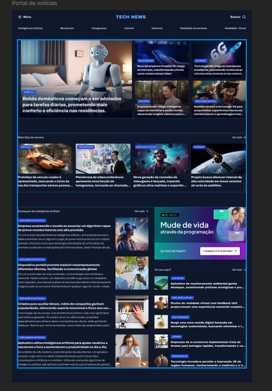

# 📰 Portal de Notícias

Projeto de **Portal de Notícias** desenvolvido com **HTML e CSS **, com foco na construção de **layouts avançados utilizando CSS Grid**.  
Este projeto faz parte de um **desafio da Rocketseat**, para a prática de layout.

---

## 🚀 Preview

---

## 🧠 Sobre o Projeto

Durante o desenvolvimento, foram praticados:

- HTML semântico e bem estruturado  
- Layout complexo com **CSS Grid**  
- Organização visual em colunas e áreas  
- Criação de cards de notícias  
- Hierarquia de informação e tipografia  

---

## 🧩 Estrutura do Layout

O projeto é composto por:

- Header com navegação primária e secundária  
- Seção de destaques com grid assimétrico  
- Área de notícias mais lidas da semana  
- Seção dedicada à Inteligência Artificial  
- Aside com anúncios e conteúdos complementares  
- Footer simples e funcional  
---

## 🛠 Tecnologias Utilizadas

- **HTML5**  
- **CSS3**  
  - CSS Grid  
  - JavaScript 

---

## 🎯 Objetivo do Desafio

Este projeto foi criado para:

- Praticar **CSS Grid** em layouts reais  
- Melhorar a organização visual de páginas complexas  
- Reforçar boas práticas de HTML e CSS  

---

## 📚 Desafio Rocketseat

Projeto desenvolvido como parte dos **desafios práticos da Rocketseat**, com foco na evolução contínua em **Front-end**.

